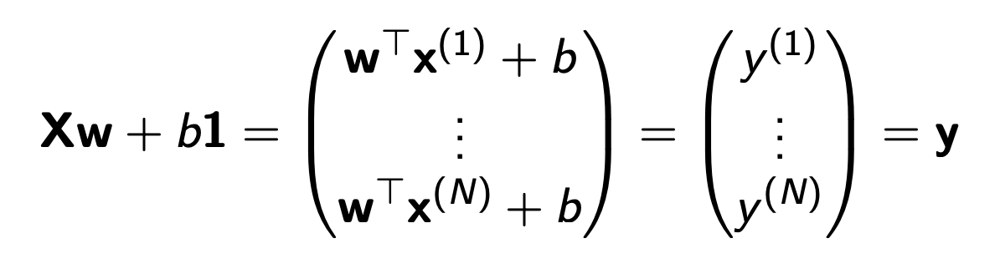

# Decision Tree
A `Decision Tree` is a machine learning algorithm

Entropy: $H(x) = -\sum p(x)log_2 p(x)$

用entropy来确定一个model的`惊讶度`

  * High Entropy - 比如掷骰子，uniform distribution，每一种情况出现的可能都相似，所以难以预测
  * Low Entropy - distribution 有很多peak和valley，某些情况可能性很高，就更好预测。

Entropy也能计算joint distribution，eg.

`Entropy`: $H(x,y) = -\sum\sum p(x,y)log_2 p(x,y)$

   $H(x,y)=-\frac{24}{100}log_2\frac{24}{100}-\frac{25}{100}log_2\frac{25}{100}-\frac{1}{100}log_2\frac{1}{100}-\frac{50}{100}log_2\frac{50}{100}\approx 1.56~bit$
   $H(Y|X)= \sum p(x)H(Y|X=x)$

`Information Gain` 表示一个dataset给了我们多少信息

$IG(Y |X) = H(Y ) − H(Y |X)$

# Machine Learning Algorithm

## Loss Function
loss for a single data
### 0-1 Loss

$L_{0-1}(y, t)=
\begin{cases}
  0 & \text{if }y\ne t\\    
  1 & \text{if }y=t
\end{cases}
$

$L(y,t) =\frac{1}{2}(y-t)^2$

* y是model预测出的结果
* t是实际的结果
* y*是$E[t|x]$, best possible predition

---
Given p(t|x) 已知所有条件时可以算出结果的概率把
t视为random variable: randomness 在于即使我们知道所有的参数x
，也并不能确保t就是我们认为的结果。
$$
\begin{aligned}
    E[(y-t)^2|x] &= E[y^2-2yt+t^2~|~x]\\
     &=y^2-2yE[t|x] + E[t^2|x]\\
     &=y^2-2yy^* + y^{*2}+Var[t|x]\\
     &=(y- y_*)^2+Var[t|x]\\
\end{aligned}
$$
$Var[t|x]$ 是 bayes error, 把t是为random variable，
model预测出的结果和最可能的结果y*之间有误差，并且无法消除。

---
现在把y（model预测出的结果）当作random 
variable-randomness在于每个dataset都不同，所有最后都model一定有些许差别。
$$
\begin{aligned}
    E[(y-t)^2] &= E[(y-y*)^2] + Var[t]\\
    &= E[y^2-2yy^* + y^{*2}] + Var[t]\\
    &=E[y^2-2yy^*] + y^{*2} + Var[t]\\
    &=E[y^2]-2y^*E[y] + y^{*2} + Var[t]\\
    &=E[y]^2-2y^*E[y] + y^{*2} + Var[y] + Var[t]\\
    &=(E[y] - y^*2)^2 + Var[y] + Var[t]\\
    
\end{aligned}
$$
$bias => E[y]$ 是预测平均值都准确度, `underfitting`

$variance => Var[y]$ 是预测点离平均值都分散度, `overfitting`

## `Bagging` - 一种machine learning的trick
bagging是从一个dataset提取出m个小dataset，每个小dataset都长度都为n，可以reduce variance，减少overfit
$$
Var[y] = Var[\frac{1}{m}\sum^{m}_{i=0}y_i]=\frac{1}{m^2}\sum^{m}_{i=0}y_i]=\frac{1}{m}Var[y_i]\\
E[y] = E[\frac{1}{m}\sum^{m}_{i=0}y_i]=\frac{1}{m}E[\sum^{m}_{i=0}y_i] = E[y_i]
$$
`缺点` - 小dataset是从大dataset里提取出来的，所以小dataset之间可能存在correlation。
     对于variance的减少无法达到$\frac{1}{m}$

---
## `Ada Boosting` - 一种减少E[x]的尝试
Weak Learner 是指一种比随机稍准确的machine，比如猜硬币有55%的准确率的model。
如果我们把很多的weak learner加在一起，就能够做出一个足够精准的model。

对于一个单一的weak learner:
$$
err = \sum^N_{i=1}w_i\Iota(h(x_i)\ne y_i)
$$
w是一个vector，里面存着的是每一个y对应的weight。

I也是一个vector，里面存着的是每一个是否正确。如果正确为1，如果错误为0。

那么 $w\times I$就是某一个错误数据点的w，$\sum$就是所有数据点weight的和。

我们每次做完weak learner之后，将错误数据点的w值调大，然后重新train这个model，重复这个过程.

## `Linear Regression` - 一种machine learning algorithm.
对于一个machine learning: 
1. 选择一个合理的model（在linear regression中，选择哪种函数）
2. 选择一个loss function，以便测算model预测出的y和target之间的差距。
3. regulazation
4. optimazation
   
$x^{(i)}$是一个input，x是一个scaler，是特性。

$t^{(i)}$是output，是target，是在人类世界中的结果。

我们要通过input预测出一个output， y。 我们希望y与t尽量接近。

$y = wx+b$

    y是prediction，
    w是weight
    b是bias
    w和b统称为parameter

$L(y,t) =\frac{1}{2}(y-t)^2$

我们希望$y-t$尽量小。

### `Cost Function`
$$
\begin{aligned}
J(w,b) &=\frac{1}{N}\sum^N_{i=1}\frac{1}{2}(y^{(i)}-t^{(i)})^2\\
&= \frac{1}{2N}\sum^N_{i=1}(y^{(i)}-t^{(i)})^2\\
& = \frac{1}{2N}\sum^N_{i=1}(wx^{(i)}+b-t^{(i)})^2
\end{aligned}
$$
Cost Function是loss Function average all training example

如果x和w均是vector，我们只需要
$$ Y=\vec{W^T}*\vec{X} + b $$
在python中，我们使用numpy做matrix multiplation，因为matrix multiplication在GPU上快。

$$
  y=np.dot(X,w) + b\\
  cost = np.sum((y-t)^2)/(2\times N)
$$
X, w, y, t are vectors and N is number of data.

 Cost方程最小的时候，y-t的差距就最小，此时我们找到了linear regression中的最优模型

`Critical Point`

Critical Point是函数图像中local/global min/max的点，在此点上derivative为0.在这个点上y-t的值最小/大。

`Gradient Descent`
Gradient Descent 梯度下降是一种找到derivative为0的点的方法。

$$
\begin{aligned}
w &\lArr w-\alpha\frac{dJ}{dw}\\
& =w- \frac{\alpha}{N}\sum^N_{i=1}(y^{i}-t^{i})x^{(i)}
\end{aligned}
$$
$\alpha$是一个hyperparameter，是不能学习的，$\frac{dJ}{dw}$是function在某个点的斜率，所以w会根据斜率一次下降，直到斜率
等于0.
