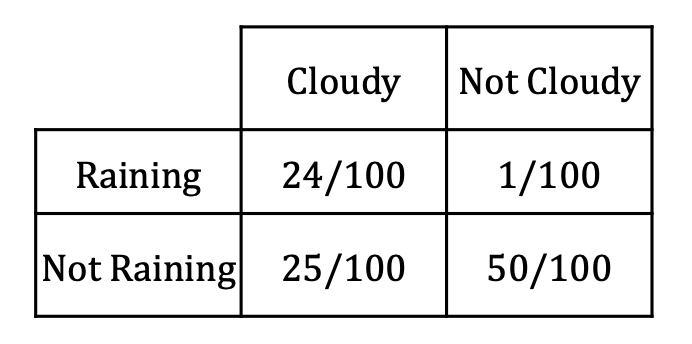

A `Decision Tree` is a machine learning algorithm

Entropy: $H(x) = -\sum p(x)log_2 p(x)$

用entropy来确定一个model的`惊讶度`

  * High Entropy - 比如掷骰子，uniform distribution，每一种情况出现的可能都相似，所以难以预测
  * Low Entropy - distribution 有很多peak和valley，某些情况可能性很高，就更好预测。

Entropy也能计算joint distribution，eg.
\

Entropy: $H(x,y) = -\sum\sum p(x,y)log_2 p(x,y)$
